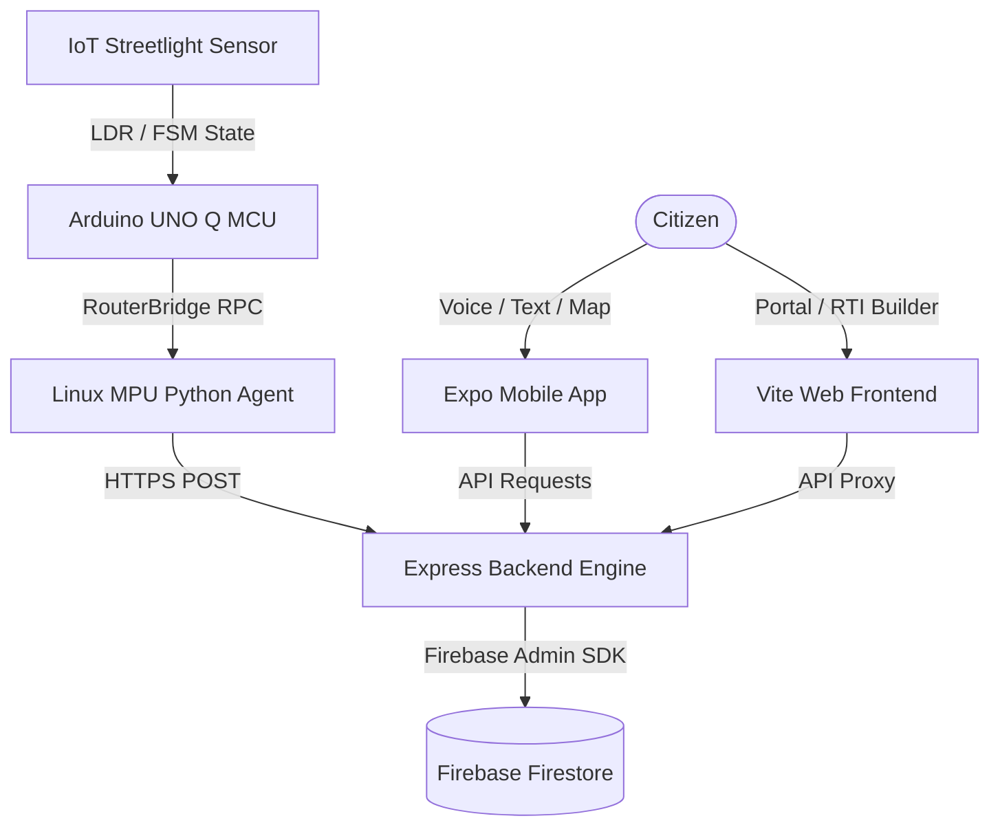

# JanSetu Multiverse

A Firestore-powered, multilingual civic intelligence platform that bridges the gap between citizens, public infrastructure, and municipal administration. By integrating a **Web Dashboard**, an **Expo Mobile App**, and **IoT Edge Sensors**, JanSetu Multiverse automates issue detection, resolves duplicate complaints, and streamlines department-wise resolution.

---

##  System Overview & Architecture

JanSetu Multiverse is comprised of three main layers working in sync:
1. **Web Portal & Backend Engine**: Serves as the administrative control center and provides real-time complaint analytics (Firebase Firestore) alongside a general public portal.
2. **Mobile Application (Expo/React Native)**: Empowers citizens to report and track complaints on-the-go via text, voice, and interactive hazard maps.
3. **IoT Edge Nodes (Arduino UNO Q)**: Monitors physical civic infrastructure (like streetlights) and reports structural failures directly to the cloud.



---

## 🛠️ Consolidated Tech Stack

| Component | Tech Stack / Libraries |
| :--- | :--- |
| **Backend** | Node.js, Express, Python 3, `llama-cpp-python` (Local LLM Bridge), `firebase-admin` |
| **Web Frontend** | React 18, Vite, Tailwind CSS, TypeScript, Leaflet Maps |
| **Mobile App** | Expo (React Native), Expo Router, TypeScript, NativeWind, Supabase Client |
| **IoT Edge Node** | Arduino C++ (MCU firmware), Python 3 (MPU RouterBridge RPC & Requests) |
| **Databases** | Firebase Firestore (Real-time document store) |

---

##  Repository Structure

```text
JANSETU-MULTIVERSE/
├── app/                  # Expo mobile application layouts, screens, and routes
├── jansetu-backend/      # Express backend server, database adapters, and AI scripts
│   ├── ai/               # Local Qwen LLM, YOLO anomaly, and RTI drafting scripts
│   ├── db/               # Firebase database adapter
│   └── routers/          # Express API route handlers
├── lib/                  # Shared business logic, translations, and database helpers
├── src/                  # Web frontend source code (components, pages, styles)
├── sketch/               # Arduino UNO Q streetlight sensor C++ firmware
└── python/               # Linux MPU Python agent for IoT edge gateway
```

---

##  1. Web Application & Backend Engine

### About
The Web Application serves as the administrative interface and analytical engine. It handles data persistence using Firebase Firestore, AI-driven analysis, automatic routing to local departments, and real-time dashboard tracking.

### Key Features
* **Bilingual Dashboard**: Toggles interface languages (Hindi and English).
* **AI-Assisted Routing**: Categorizes raw complaints, predicts urgency, and routes them to appropriate departments.
* **Complaint Association**: Automatically groups similar complaints within the same ward and issue category.
* **Interactive Live Maps**: Aggregates clustered complaints and IoT anomalies for municipal officers.
* **SLA & Escalation Tracker**: Enables administrators to review officer assignments and SLAs.

### Installation

#### Prerequisites
* Node.js (version 18 or higher)
* Python 3
* Firebase Firestore project credentials (`firebase-service-account.json`)
* Local LLM package: `pip install llama-cpp-python`

#### Setup Steps

1. **Clone the repository and enter directory:**
   ```bash
   git clone https://github.com/PRIYANKA-NEGI-28/JANSETU-MULTIVERSE.git
   cd JANSETU-MULTIVERSE
   ```

2. **Configure Environment Variables & Credentials:**
   Create a `.env` file inside the `jansetu-backend` directory (see [Environment Variables](#environment-variables)):
   ```env
   PORT=3000
   ```
   Download your Firebase service account private key JSON file, rename it to `firebase-service-account.json`, and place it in the `jansetu-backend` root folder.

3. **Install and Start Backend Engine:**
   ```bash
   cd jansetu-backend
   npm install
   # For local LLM inference, ensure models are provisioned in jansetu-backend/ai/models/
   npm run dev
   ```

4. **Install and Start Web Frontend:**
   Open a new terminal at the project root directory and run:
   ```bash
   npm install
   npm run dev
   ```
   The web application will run locally at `http://localhost:5173`.

---

## 📱 2. Mobile Application

### About
The Mobile Application provides a portable portal for citizens to report civic grievances, map nearby issues, and draft statutory applications.

### Key Features
* **Speech to Text**: Multi-dialect voice complaint filing with automatic transcription.
* **Dynamic Location Tagging**: Extracts device coordinates to identify city, area, and ward.
* **RTI Query Builder**: Generates statutory applications under Section 6(1) of the RTI Act.
* **Real-Time Tracking**: Subscribes to live WebSocket status updates for complaint lifecycle states.

### Installation

#### Prerequisites
* Node.js 18 or later
* Android Studio (with emulator) or physical Android device
* Expo Go app installed on your testing device

#### Setup Steps

1. **Configure Mobile Environment Variables:**
   Create a `.env` file in the project root:
   ```env
   EXPO_PUBLIC_NEO4J_PROXY_URL=http://localhost:3000
   EXPO_PUBLIC_SARVAM_API_KEY=your_sarvam_api_key
   EXPO_PUBLIC_GEMINI_API_KEY=your_gemini_api_key
   EXPO_PUBLIC_COMPLAINT_SERVER_URL=http://localhost:3000
   ```

2. **Switch to Expo Configuration:**
   Rename the package files to swap the active environment from Web to Expo:
   ```bash
   # From project root
   cp package.json package-web.json
   cp package-expo.json package.json
   npm install
   ```

3. **Start the Development Server:**
   ```bash
   npx expo start
   ```
   Scan the QR code printed in the terminal using your phone's **Expo Go** application.

4. **Build & Deploy Android APK (Optional):**
   Ensure USB Debugging is enabled, then execute:
   ```bash
   # Compile APK
   ./android/gradlew -p android assembleRelease --no-daemon
   # Install to device via ADB
   adb install -r jansetu-app.apk
   # Launch App
   adb shell am start -n com.jansetu.app/.MainActivity
   ```

---

##  3. IoT Edge Device (Streetlight Monitor)

### About
The IoT Edge component is a streetlight monitoring gateway. Using an LDR sensor paired with a Finite State Machine (FSM), the MCU filters out transient lighting disturbances (like vehicle headlights or lightning) and sends stable fault alerts to the Render backend.

### Detection & State Transitions
The MCU operates as a reactive FSM containing three core states:
* `NORMAL`: Light detected, green LED active.
* `POSSIBLE_FAULT`: Light level drops below target threshold; initiates a verification countdown.
* `FAULT_CONFIRMED`: Darkness persists beyond validation threshold; signals alarm to MPU, red LED active.

### Hardware Schematics
* **MCU**: Arduino UNO Q
* **Input**: Photoresistor (LDR) sensor module
* **Outputs**: Red LED (Fault Indicator), Green LED (Normal Indicator), White LED (Simulated Streetlight)
* **Testing Control**: Tactile push button (forces repair simulation state)

### Setup & Deployment

1. **Firmware Flash:**
   Open the files under `sketch/` in your Arduino IDE, connect your Arduino UNO Q, and flash `sketch.ino`.

2. **Setup MPU Python Agent:**
   On your onboard Linux environment (MPU):
   ```bash
   cd python
   pip install -r requirements.txt
   ```

3. **Configure Edge Gateway:**
   Edit `config.py` to point the agent to your deployed backend url:
   ```python
   self.backend_url = "https://jansetu-multiverse.onrender.com"
   ```

4. **Start Gateway:**
   Launch the python process. It will communicate with the MCU via RouterBridge RPC to poll state and transmit JSON payloads to the cloud:
   ```bash
   python main.py
   ```

---

##  Future Improvements

* **Multi-Sensor Edge Expansion**: Expand IoT firmware to track water level sensors (flood warning) and gas leak models.
* **Offline-First Sync**: Introduce Local database synchronization for mobile clients in regions with weak connectivity.
* **Expanded Translation Matrix**: Support all 22 scheduled Indian languages for both text-to-speech and complaint templates.
* ** Automation for Future Environmental Hazard Detection

---

## 👥 Contributors

* **Ritu Raj Sinha** — [riturajsinha040@gmail.com](mailto:riturajsinha040@gmail.com)
* **Rishav Raj** — [rishavraj.rr124@gmail.com](mailto:rishavraj.rr124@gmail.com)
* **Divyansh Gupta** — [divyanshvinu12@gmail.com](mailto:divyanshvinu12@gmail.com)
* **Priyanka Negi** — [priyankaviveknegi@gmail.com](mailto:priyankaviveknegi@gmail.com)

---

## License

This project is licensed under the [MIT License](LICENSE).
